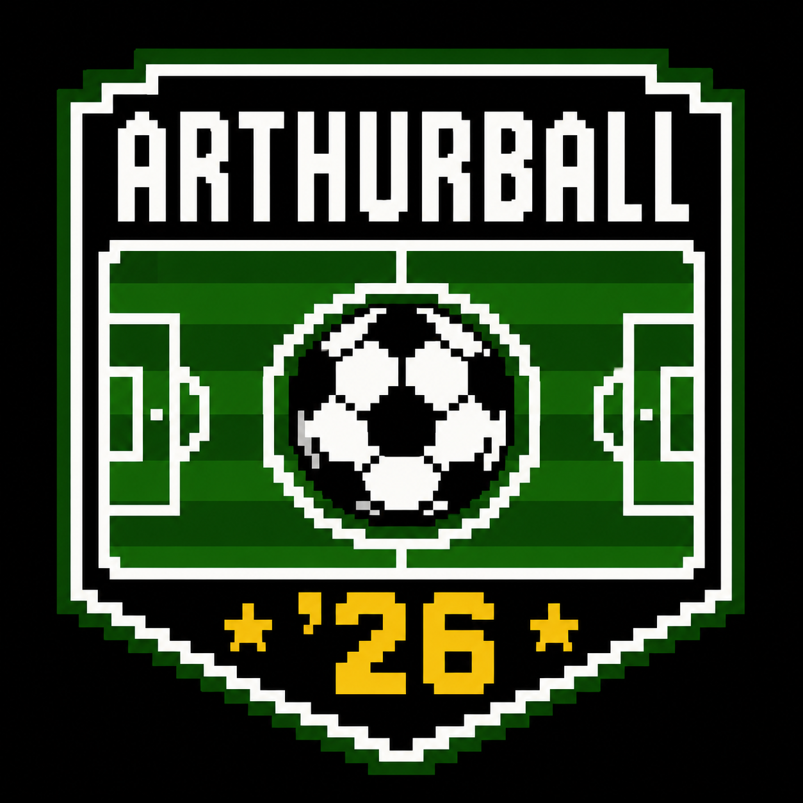

# arthurball '26

> AI-powered EA FC 26 Ultimate Team advisor — screenshot analysis, squad building, SBC solving, live market prices.



---

## Features

| Tab | What it does |
|-----|-------------|
| 📸 EKRAN | Upload a FUT screenshot — Claude Vision analyzes your squad, SBC, or market screen |
| 👥 KADRO | Budget + preferences → Claude recommends an optimal squad with prices and chemistry |
| 🧩 SBC | Enter SBC requirements → Claude finds the cheapest solution |
| 📈 MARKET | Ask market questions with live fut.gg player prices |

## Stack

| Layer | Tech |
|-------|------|
| Backend | Python 3.11 · FastAPI · `AsyncAnthropic` |
| AI | `claude-opus-4-7` · adaptive thinking · vision |
| Live data | fut.gg API · `curl_cffi` Chrome TLS impersonation |
| Frontend | React 18 · TypeScript · Vite · Press Start 2P font |

## Quick Start

### Backend
```bash
cd v0.0.2/backend
cp .env.example .env        # add your ANTHROPIC_API_KEY
python -m pip install -r requirements.txt
python -m uvicorn main:app --reload
# → http://localhost:8000
```

### Frontend
```bash
cd v0.0.2/frontend
npm install
npm run dev
# → http://localhost:5173
```

> **Important:** Run backend in its own terminal window — keep it open while using the app.

## API Keys

| Key | Required | Where |
|-----|----------|-------|
| `ANTHROPIC_API_KEY` | Yes | [console.anthropic.com](https://console.anthropic.com) |
| `FUTDB_API_KEY` | No | fut.gg is used instead (no key needed) |

## Architecture

```
Browser  →  React + Vite  :5173
                │
                ▼
         FastAPI  :8000
         ├── POST /api/analyze          Claude Vision
         ├── POST /api/squad/build      Claude
         ├── POST /api/sbc/solve        Claude
         ├── POST /api/market/advice    fut.gg + Claude
         └── GET  /api/market/player/{name}   fut.gg live search
```

## Live Data

Player prices are fetched from `https://www.fut.gg/api/fut/players/v2/26/` using `curl_cffi` with Chrome TLS fingerprint impersonation — no API key required.

---

## Changelog

### v0.0.3 — bilingual TR/EN support
- **Language switcher** in the header — pixel art Turkey 🇹🇷 and England 🏴󠁧󠁢󠁥󠁮󠁧󠁿 flag buttons
- Full **English translation** of all UI text (labels, placeholders, buttons, results)
- Custom pixel art SVG flags (`flag-tr.svg`, `flag-en.svg`) — `shape-rendering="crispEdges"`, consistent style
- `i18n.ts` type-safe translation system + `LangContext` React context
- All components use `useLang()` hook — language switch is instant, no reload

### v0.0.2 — pixel art UI
- Full **arthurball '26** brand identity with pixel art logo
- **Press Start 2P** pixel font throughout
- Black background + bright green saha-çizgisi card borders
- Logo as fixed background watermark and favicon
- Live fut.gg player prices (curl_cffi, Cloudflare bypass)
- Fixed player rating field (`overall` not `rating`)
- Global FastAPI exception handler with detailed error traces
- Frontend 120s timeout with Turkish error messages

### v0.0.1 — initial release
- FastAPI backend with 4 endpoints
- React + TypeScript frontend with 4 tabs
- Claude Opus 4.7 + adaptive thinking + vision

---

**Designer:** Ertuğ Demir · **Coded by:** [Claude Code](https://claude.ai/claude-code)
